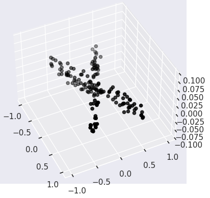
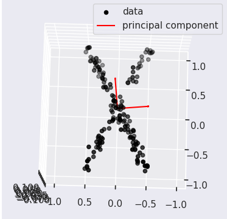
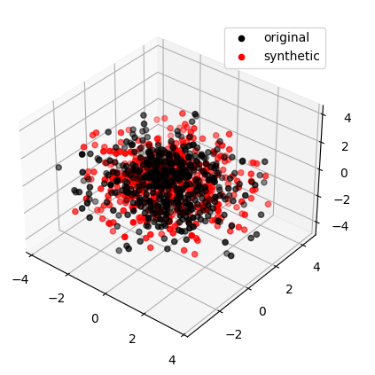

<style>
img[alt~="center"] {
  display: block;
  margin: 0 auto;
}
</style>

##### Probabilisitc Principal Component Analysis

### Journal of the Royal Statistical Society

---

# Outline

1) Motivation
2) Theory
3) Applications
4) Further Reading

<!-- _footer: All code is available at https://github.com/cmaspi/Maths_Behind_ML/tree/main/Presentation -->

---

##### Motivation

---

1) **Generative model:** PPCA is a generative model. It can generate new data samples from the learned model.
2) **Missing Data:** PCA cannot handle missing data well. PPCA can naturally handle missing data by considering it as a part of the probabilistic model and estimating it along with other parameters
---

##### Theory

---

# PCA

$$
\begin{align}
z &= Ux \\
x &\approx Wz 
\end{align}
$$

---

# PPCA

$$x = Wz + \mu + \epsilon$$

We can assume that the data is zero-mean to make things easier

$$
\begin{align}
x &= Wz + \epsilon \\
& where \quad z \sim \mathcal{N}(0, I)\\
&\quad\quad\quad\ \ \ \epsilon \sim \mathcal{N}(0, \sigma^2 I)
\end{align}
$$

---
## Assumptions
1. **Homoscedasticity:** the amount of noise is constant across all data points
2. **zero-mean, gaussian noise:** The noise should follow gaussian distribution with covariance proportional to identity, and should be zero mean.
3. **Observed data follows multivariate gaussian**

---

# PCA vs ICA




---

# Contd.



---

# PCA: Goal
> It can be proved that under a common loss function, mean squared
error (i.e. $L_2$ norm), PCA provides the optimal reduced representation of the data. This means that selecting orthogonal directions for principal components is the best solution to predicting the original data. Given the example above, how could this statement be true?

> The solution to this paradox lies in the goal we selected for the
analysis. The goal of the analysis is to decorrelate the data, or said in other terms, the goal is to remove second-order dependencies in the data. In the aforementioned dataset, higher order dependencies exist between the variables. Therefore, removing second-order dependencies is insufficient at revealing all structure in the data

<!-- _footer: https://arxiv.org/pdf/1404.1100.pdf-->

---
<!-- _footer: Here correlation is assumed to be Pearson's Correlation-->

## Uncorrelated vs Independent

$$
\begin{align}
Independence \implies Uncorrelated \\
Uncorrelated \centernot\implies Independence
\end{align}
$$

#### For Gaussians
$$
\begin{align}
Independence \iff Uncorrelated
\end{align}
$$

---

# Properties of Gaussians

---

<!-- _footer: https://en.wikipedia.org/wiki/Multivariate_normal_distribution#Correlations_and_independence \n https://math.stackexchange.com/questions/2994933/is-a-random-vector-multivariate-normal-if-and-only-if-every-linear-combination-o -->

## Definition

A random vector is said to be *k-variate* normally distributed if every linear combination of its k components has a univariate normal distribution.

---
## Affine Transformation

$$
\begin{align}
X \sim \mathcal{N}\left(\mu, \Sigma\right)
\end{align}
$$
Then
$$
\begin{align}
AX+b \sim \mathcal{N}\left(A\mu+b, A\Sigma A^T\right)
\end{align}
$$
<!-- _footer: Hint: Use the first property-->
---

## Marginalization
If
$$
\begin{align}
X = \begin{pmatrix} X_1 \\ X_2 \end{pmatrix} \sim \mathcal{N}
\left(
    \begin{pmatrix}\mu_1\\\mu_2\end{pmatrix},
    \begin{pmatrix}
        \Sigma_{11} & \Sigma_{12}\\
        \Sigma_{21} & \Sigma_{22}
    \end{pmatrix}
    \right)
\end{align}
$$
Then
$$
\begin{align}
X_1 \sim \mathcal{N}\left( \mu_1, \Sigma_{11} \right)
\end{align}
$$
<!-- _footer: Hint: Use the first property-->

---

## Conditioning

If
$$
\begin{align}
X = \begin{pmatrix} X_1 \\ X_2 \end{pmatrix} \sim \mathcal{N}
\left(
    \begin{pmatrix}\mu_1\\\mu_2\end{pmatrix},
    \begin{pmatrix}
        \Sigma_{11} & \Sigma_{12}\\
        \Sigma_{21} & \Sigma_{22}
    \end{pmatrix}
    \right)
\end{align}
$$
Then
$$
\begin{align}
X_1 | X_2=x_2 \sim \mathcal{N}\left( \mu_1 + \Sigma_{12}\Sigma_{22}^{-1}(x_2-\mu_2), \Sigma_{11} - \Sigma_{12}\Sigma_{22}^{-1}\Sigma_{21} \right)
\end{align}
$$

<!-- _footer: Proof https://statproofbook.github.io/P/mvn-cond.html-->

---

# PPCA

$$
\begin{align}
x &= Wz + \epsilon \\
& where \quad z \sim \mathcal{N}(0, I)\\
&\quad\quad\quad\ \ \ \epsilon \sim \mathcal{N}(0, \sigma^2 I)
\end{align}
$$

We can view the above formulation in multiple ways
1. $z|x$: Dimensionality reduction
2. $x|z$: Data generation

---


# Contd.
$$
\begin{align}
x = Wz+\epsilon \implies x \sim \mathcal{N}(?, ?)
\end{align}
$$
Using the affine transform property, we get
$$
\begin{align}
x \sim \mathcal{N}\left( 0 , WW^T+\sigma^2I \right)
\end{align} \tag{1}
$$
Define $C:=WW^T+\sigma^2I$

---
# Contd.
### Conditional Distribution (Data Generation)

$$x|z \sim \mathcal{N}\left(Wz, \sigma^2 I\right)$$

### Joint Distribution
$$
\begin{align}
p(x,z) &= p(x|z)p(z)\\
p(x,z) &\propto \exp\left(
  \frac{-1}{2\sigma^2} \left( x-Wz\right)^T\left( x-Wz\right)
  \right)
  \exp\left(\frac{-1}{2}z^Tz\right)\\
  &\propto \exp\left(
    \frac{-1}{2}
    \begin{bmatrix}x^T & z^T\end{bmatrix}
    \begin{bmatrix} \frac{1}{\sigma^2}I& \frac{-1}{\sigma^2}W \\
    \frac{-1}{\sigma^2}W^T & \frac{1}{\sigma^2}W^T W + I \end{bmatrix}
    \begin{bmatrix}x \\ z\end{bmatrix}
  \right) \tag{2}
\end{align}
$$

---

# Contd

$$
\begin{align}
p(v) \propto \exp\left(\frac{-1}{2}v^T\Sigma^{-1}v\right)
\end{align}
$$
where $v = \begin{pmatrix}x \\ z\end{pmatrix}$, $\Sigma^{-1} = \begin{bmatrix} \frac{1}{\sigma^2}I& \frac{-1}{\sigma^2}W \\
    \frac{-1}{\sigma^2}W^T & \frac{1}{\sigma^2}W^T W + I \end{bmatrix}$

The above likelihood is that of a gaussian

$\therefore \begin{pmatrix}x \\ z\end{pmatrix} \sim \mathcal{N}\left( 0, \Sigma \right)$

---
# Contd.
### Conditional Distribution (Dimensionality Reduction)

Idea:
$$
\begin{align}
p(z|x) = \frac{p(x|z)}{p(x)}p(z)
\end{align}
$$
We get,
$$
\begin{align}
z|x \sim \mathcal{N}\left(M^{-1}W^Tx, \sigma^2M^{-1}\right), \quad where \, M = W^TW+\sigma^2I \tag{3}
\end{align}
$$

---

# How to obtain W?
Let $x_i \in \mathbb{R^d}$
The likelihood of obtaining a data point $x_i$ is given by

$$
\begin{align}
\frac{1}{(2\pi)^\frac{d}{2}}|C|^{\frac{-1}{2}}\exp\left\{\frac{-1}{2}x_i^T C^{-1} x_i\right\}
\end{align}
$$

---

# Maximizing the log-likelihood
$$
\begin{align}
\mathcal{L} = -\frac{N}{2}\left\{
    d\ln(2\pi)+\ln|C|+tr(C^{-1}S)
\right\}
\end{align}\tag{3}
$$
where
$$S = \frac{1}{N}\sum_{k=1}^{N}x_k x_k^T$$

---

# Contd.
$$
\begin{align}
\frac{\partial \mathcal{L}}{\partial W} &= N\left(C^{-1}SC^{-1}W - C^{-1}W\right)\\
&SC^{-1}W = W
\end{align}
$$

Using SVD

$$
\begin{align}
SC^{-1}ULV^T = ULV^T
\end{align}
$$
multiply by $V$ on both sides
$$
\begin{align}
SC^{-1}UL = UL
\end{align}
$$

---
# Contd.
$$
\begin{align}
C^{-1} &= \left(WW^T+\sigma^2I\right)^{-1}\\
C^{-1} &= \left(ULV^TVLU^T+\sigma^2I\right)^{-1}\\
C^{-1} &= \left(UL^2U^T+\sigma^2I\right)^{-1}
\end{align}
$$
#### Property of matrices
$$
\begin{align}
(I+AB)^{-1}A = A(I+BA)^{-1}
\end{align}
$$

---

# Contd.
$$
\begin{align}
S\left(UL^2U^T+\sigma^2I\right)^{-1}UL = UL\\
\frac{S}{\sigma}\left(\frac{UL}{\sigma}\frac{LU^T}{\sigma}+I\right)^{-1}\frac{UL}{\sigma} = UL
\end{align}
$$
Define $A:=\frac{UL}{\sigma}$ and $B:=\frac{LU^T}{\sigma}$
$$
\begin{align}
SUL & \left(L^2+\sigma^2I\right)^{-1} = UL\\
SUL & = UL\left(L^2+\sigma^2I\right)\\
SUL & = U\left(L^2+\sigma^2I\right)L
\end{align}
$$

---

# Contd.
For $l_j \neq 0$
$$
\begin{align}
Su_j = \left(\sigma^2+l_j^2\right)u_j
\end{align}
$$
Therefore, each column of $U$ must be an eigenvector of $S$, with corresponding eigenvalue $\lambda_j = \sigma^2+l_j^2$. So,
$$
\begin{align}
l_j = (\lambda_j-\sigma^2)^{1/2} \tag{5}
\end{align}
$$

---

# Contd. 

Therefore,
$$
\begin{align}
W = U\left(K_n-\sigma^2I\right)^{1/2}R
\end{align}
$$

where $K_n$ is a $n\times n$ diagonal matrix

$$
k_{jj} = \begin{cases}\lambda_j & \text{eigenvalue corresponding to }u_j\\
\sigma^2 & o/w\end{cases}

$$

$R$ is any rotation matrix.

---

# Contd.
$$
\begin{align}
C &= WW^T+\sigma^2I\\
&= ULV^TVLU^T+\sigma^2I\\
&= UL^2U^T+\sigma^2I\\
|C| &= |UL^2U^T+\sigma^2I|
\end{align}
$$
Identity: $|I+AB| = |I+BA|$
$$\therefore |C| = |\sigma^2I+L^2| \tag{6}$$

---
# Contd.

Using (4) and (5)

$$\mathcal{L} = -\frac{N}{2}\left\{d \ln(2\pi)+\frac{1}{\sigma^2}\sum_{j=1}^{q'}\ln(\lambda_j)+(d-q')ln(\sigma^2)+q' \right\}$$

Minimizing wrt $\sigma$

$$\sigma^2=\frac{1}{d-q'}\sum_{j=q'+1}^{d}\lambda_j$$

If $\sigma^2>0$, then the $Rank(S)>n$

---

# Contd.
$$\mathcal{L} = -\frac{N}{2}\left\{d \ln(2\pi)+\sum_{j=1}^{q'}\ln\lambda_j+(d-q')ln\left(\frac{1}{d-q'}\sum_{j=q'+1}^{d}\lambda_j\right)+d \right\}$$

Define $A:= \sum_{j} \ln{\lambda_j}$
Define $E := \ln\left(\frac{1}{d-q'}\sum_{j=q'+1}^{d}\lambda_j\right) - \frac{1}{d-q'}\sum_{j=q'+1}^{d}\ln\lambda_j$


The minimization of $E$ only leads to the requirement of $\lambda_j$ to be adjacent in the spectrum of eigenvalues (why?). Using (5), we conclude that the smallest $d-q'$ values should be discarded.

---

# Contd.
We can write $E$ from the previous slide in an equivalent way as follows.
$$E = \ln{x^Te} - \frac{1}{n}\sum_{i=1}^{n}\ln x_i$$

$$\nabla_x E = \frac{e}{x^Te} - \frac{1}{n}\sum_{i=1}^{n}\frac{e_i}{e_i^Tx}$$

The above is $0$ when all components of $x$ are equal.

<!-- _footer: https://math.stackexchange.com/questions/4795075/prove-that-the-discarded-eigenvalues-should-be-adjacent-in-probabilistic-pca-->
---

# Equivalence with PCA

It can be seen that, when $\sigma^2 \rightarrow 0$, $M^{-1}\rightarrow(W^TW)^{-1}$.

The maximum likelihood reconstruction could be written as
$$
\begin{align}
\tilde x &= WM^{-1}W^Tx\\
&= U\Lambda^{1/2}(\Lambda^{1/2}U^TU\Lambda^{1/2})^{-1}\Lambda^{1/2}U^Tx\\
&= UU^Tx
\end{align}
$$
This is same as PCA (in the reconstruction sense)

---

# Optimality: Reconstruction
When $\sigma^2 > 0$ then the latent projection becomes skewed.

$$\langle z|x \rangle = M^{-1}W^Tx$$
The above equation doesn't represent an orthogonal projection of $z$ and is therefore not optimal in squared reconstruction loss sense. However, the optimal reconstruction can still be obtained from the conditional latent mean and is given by

$$
\begin{align}
\tilde x = W (W^TW)^{-1}M \langle z|x \rangle
\end{align}
$$

The reconstruction obtained here would be the same as PCA.

<!-- _footer: https://github.com/cmaspi/Maths_Behind_ML/blob/main/Presentation/comparison_with_pca.ipynb -->

---

##### Applications

---
# Code
```python
import numpy as np


class PPCA:
    def __init__(self, n_components: int) -> None:
        self.n_components = n_components

    def fit(self, X: np.ndarray):
        cov = np.dot(X.T, X)/X.shape[0]
        evals, evecs = np.linalg.eigh(cov)
        evals = evals[::-1]
        evecs = evecs[:, ::-1]
        self.evals = evals[:self.n_components]
        self.evecs = evecs[:, :self.n_components]
        self.sigma_sq = evals[self.n_components:].mean()
        diag = np.power(self.evals - self.sigma_sq, 1/2)
        diag = np.diag(diag)
        self.W = self.evecs @ diag

    def transform(self, X: np.ndarray) -> np.ndarray:
        M = self.W.T @ self.W
        M += self.sigma_sq * np.eye(M.shape[0])
        M_inv = np.linalg.inv(M)
        z = (M_inv @ self.W.T @ X.T).T
        return z

    def fit_transform(self, X: np.ndarray) -> np.ndarray:
        self.fit(X)
        return self.transform(X)

    def inverse_transform(self, Z):
        X = []
        for z in Z:
            mean = self.W @ z
            variance = self.sigma_sq * np.eye(self.W.shape[0])
            x = np.random.multivariate_normal(mean, variance)
            X.append(x)
        return np.array(X)

    def gen_data(self, n_samples):
        Z = np.random.multivariate_normal(
            np.zeros(self.n_components),
            np.eye(self.n_components))
        return self.inv_transform(Z)
```

---

# Data Generation

<!-- _footer: https://github.com/cmaspi/Maths_Behind_ML/blob/main/Presentation/data_generation.ipynb-->

---

# Missing Data
**Problem** certain components of a given datapoint $x$ are not known.

We can solve the problem $\langle x_i | x \backslash x_i\rangle$ using the conditional property of gaussians.

<hr>

Alternatively, we can directly obtain the latent representation using first marginalization and then conditioning.

<!-- _footer: Left as an excercise-->
---

##### Further Reading

---

1. Heteroscedasticity: The noise doesn't follow homoscedasticity
 https://www.microsoft.com/en-us/research/uploads/prod/2006/01/Bishop-Pattern-Recognition-and-Machine-Learning-2006.pdf, page: 583-586
2. Bayesian PCA: Find the number of components for latent space.
https://proceedings.neurips.cc/paper_files/paper/1998/file/c88d8d0a6097754525e02c2246d8d27f-Paper.pdf
3. Outlier Detection: https://www.sciencedirect.com/science/article/pii/S0167947309001248


